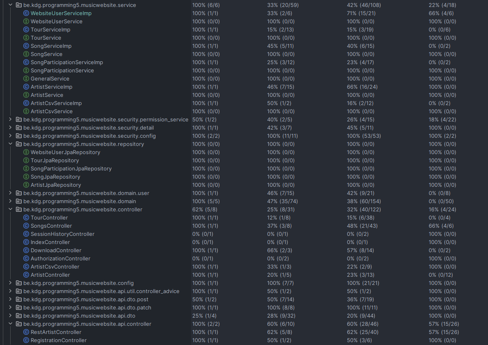
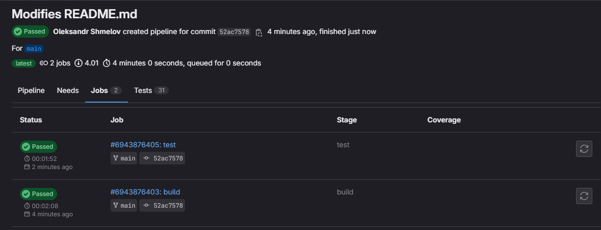

# MusicTracker 
MusicTracker is a basic CRUD website made using <b>Spring</b> and <b>Thymeleaf</b>. The project is made by <b>Oleksandr Shmelov</b>, student of <i>Karel de Grote Hogeschool</i>.

## Author
<b>Oleksandr Shmelov</b> <i>(oleksandr.shmelov@student.kdg.be)</i> 
<p><i> Student ID:</i> <b>0159900-44</b></p>
<p><i> Academic year:</i> <b>2023-2024</b></p>
<p><i> Group:</i> <b>ACS-202</b></p>

## About
This project was created for a college assignment.
It reflects what we have learned in the academic program.

### Entities relationships
There are 3 main entities in the project: <b>Artist</b>, <b>Song</b> and <b>Tour</b>.  
The structure is as follows:
* <b>Artist</b> can have many <b>Songs</b> and many <b>Tours</b>
* <b>Song</b> can be made by many <b>Artists</b>. (Many-to-Many)
* <b>Tour</b> can be performed by one <b>Artist</b>. (One-to-Many)
  
## Build/Run

### Requires:
* Java 17 (or higher)
* Nodejs
* Npm
* Docker

### To run:
```shell
docker-compose up -d
./gradlew build
./gradlew bootRun
```

#### Server port:<b> 8080</b>. 
Access [here](http://localhost:8080).

### Profiles

* <b>test</b> - Changes database to the "testing" one. Used only to run tests.

### Tests
To run all tests execute the following:
```shell
./gradlew test
```

## Week 2
```http request
###
# Fetching all artists - OK 
# @no-redirect
GET http://localhost:8080/api/artists
Accept: application/json

Response:
HTTP/1.1 200 
  
Headers:
Content-Type: application/json

Body:
[
  {
    "id": 1,
    "name": "Taylor Swift",
    "birthDate": "1989-12-13",
    "listeners": 100734996
  },
  {
    "id": 2,
    "name": "Ed Sheeran",
    "birthDate": "1991-02-17",
    "listeners": 74889692
  },
  {
    "id": 3,
    "name": "Beyonce",
    "birthDate": "1981-09-04",
    "listeners": 49366942
  },
  {
    "id": 4,
    "name": "Elvis Presley",
    "birthDate": "1935-01-08",
    "listeners": 17850458
  }
]


###
# Fetching one artist - Not Found
# @no-redirect
GET http://localhost:8080/api/artists/6
Accept: application/json

Response:
HTTP/1.1 404 
  
Headers:
Content-Type: application/problem+json

Body:
{
  "type": "about:blank",
  "title": "Not Found",
  "status": 404,
  "detail": "No artists with given id have been found.",
  "instance": "/api/artists/6"
}

###
#Fetching one artist - OK
# @no-redirect
GET http://localhost:8080/api/artists/4
Accept: application/json

Response:
HTTP/1.1 200 

Headers:
Content-Type: application/json

Body:
{
  "id": 4,
  "name": "Elvis Presley",
  "birthDate": "1935-01-08",
  "listeners": 17850458
}
```

## Week 3

* Creating an artist - CREATED
```http request
POST http://localhost:8080/api/artists
Accept: application/json
Content-Type: application/json

{
  "name": "test name",
  "birthDate": "2000-01-01",
  "listeners": 1000
}
```
Response:
```http request
HTTP/1.1 201 

Headers:
Content-Type: application/json

Body:
{
  "id": 5
  "name": "test name",
  "birthDate": "2000-01-01",
  "listeners": 1000
}

```
* Creating an artist - BAD REQUEST
```http request
POST http://localhost:8080/api/artists
Accept: application/json
Content-Type: application/json

{
  "name": "na",
  "birthDate": "2222-01-01",
  "listeners": -1
}
```
Response:
```http request
HTTP/1.1 400

Headers:
Content-Type: application/json

Body:
{
  "timestamp": "2024-05-27T11:31:23.925+00:00",
  "status": 400,
  "error": "Bad Request",
  "trace": "org.springframework.web.bind.MethodArgumentNotValidException: Validation failed for argument [0] in public org.springframework.http.ResponseEntity<be.kdg.programming5.musicwebsite.api.dto.ArtistDTO> be.kdg.programming5.musicwebsite.api.controller.RestArtistController.postArtist(be.kdg.programming5.musicwebsite.api.dto.post.ArtistPostDTO,be.kdg.programming5.musicwebsite.security.detail.WebsiteUserDetails) with 3 errors: [Field error in object 'artistPostDTO' on field 'name': rejected value [na]; codes [Size.artistPostDTO.name,Size.name,Size.java.lang.String,Size]; arguments [org.springframework.context.support.DefaultMessageSourceResolvable: codes [artistPostDTO.name,name]; arguments []; default message [name],18,3]; default message [Name of the artist should be between 3 and 18 characters.]] [Field error in object 'artistPostDTO' on field 'birthDate': rejected value [2222-01-01]; codes [Past.artistPostDTO.birthDate,Past.birthDate,Past.java.time.LocalDate,Past]; arguments [org.springframework.context.support.DefaultMessageSourceResolvable: codes [artistPostDTO.birthDate,birthDate]; arguments []; default message [birthDate]]; default message [Date should be in the past.]] [Field error in object 'artistPostDTO' on field 'listeners': rejected value [-1]; codes [Min.artistPostDTO.listeners,Min.listeners,Min.long,Min]; arguments [org.springframework.context.support.DefaultMessageSourceResolvable: codes [artistPostDTO.listeners,listeners]; arguments []; default message [listeners],0]; default message [Number of listeners should be greater than 0.]] \r\n\tat org.springframework.web.servlet.mvc.method.annotation.RequestResponseBodyMethodProcessor.resolveArgument(RequestResponseBodyMethodProcessor.java:143)\r\n\tat org.springframework.web.method.support.HandlerMethodArgumentResolverComposite.resolveArgument(HandlerMethodArgumentResolverComposite.java:122)\r\n\tat org.springframework.web.method.support.InvocableHandlerMethod.getMethodArgumentValues(InvocableHandlerMethod.java:225)\r\n\tat org.springframework.web.method.support.InvocableHandlerMethod.invokeForRequest(InvocableHandlerMethod.java:178)\r\n\tat org.springframework.web.servlet.mvc.method.annotation.ServletInvocableHandlerMethod.invokeAndHandle(ServletInvocableHandlerMethod.java:118)\r\n\tat org.springframework.web.servlet.mvc.method.annotation.RequestMappingHandlerAdapter.invokeHandlerMethod(RequestMappingHandlerAdapter.java:917)\r\n\tat org.springframework.web.servlet.mvc.method.annotation.RequestMappingHandlerAdapter.handleInternal(RequestMappingHandlerAdapter.java:829)\r\n\tat org.springframework.web.servlet.mvc.method.AbstractHandlerMethodAdapter.handle(AbstractHandlerMethodAdapter.java:87)\r\n\tat org.springframework.web.servlet.DispatcherServlet.doDispatch(DispatcherServlet.java:1089)\r\n\tat org.springframework.web.servlet.DispatcherServlet.doService(DispatcherServlet.java:979)\r\n\tat org.springframework.web.servlet.FrameworkServlet.processRequest(FrameworkServlet.java:1014)\r\n\tat org.springframework.web.servlet.FrameworkServlet.doPost(FrameworkServlet.java:914)\r\n\tat jakarta.servlet.http.HttpServlet.service(HttpServlet.java:590)\r\n\tat org.springframework.web.servlet.FrameworkServlet.service(FrameworkServlet.java:885)\r\n\tat jakarta.servlet.http.HttpServlet.service(HttpServlet.java:658)\r\n\tat org.apache.catalina.core.ApplicationFilterChain.internalDoFilter(ApplicationFilterChain.java:205)\r\n\tat org.apache.catalina.core.ApplicationFilterChain.doFilter(ApplicationFilterChain.java:149)\r\n\tat org.apache.tomcat.websocket.server.WsFilter.doFilter(WsFilter.java:51)\r\n\tat org.apache.catalina.core.ApplicationFilterChain.internalDoFilter(ApplicationFilterChain.java:174)\r\n\tat org.apache.catalina.core.ApplicationFilterChain.doFilter(ApplicationFilterChain.java:149)\r\n\tat org.springframework.web.filter.CompositeFilter$VirtualFilterChain.doFilter(CompositeFilter.java:108)\r\n\tat org.springframework.security.web.FilterChainProxy.lambda$doFilterInternal$3(FilterChainProxy.java:231)\r\n\tat org.springframework.security.web.FilterChainProxy$VirtualFilterChain.doFilter(FilterChainProxy.java:365)\r\n\tat org.springframework.security.web.access.intercept.AuthorizationFilter.doFilter(AuthorizationFilter.java:100)\r\n\tat org.springframework.security.web.FilterChainProxy$VirtualFilterChain.doFilter(FilterChainProxy.java:374)\r\n\tat org.springframework.security.web.access.ExceptionTranslationFilter.doFilter(ExceptionTranslationFilter.java:126)\r\n\tat org.springframework.security.web.access.ExceptionTranslationFilter.doFilter(ExceptionTranslationFilter.java:120)\r\n\tat org.springframework.security.web.FilterChainProxy$VirtualFilterChain.doFilter(FilterChainProxy.java:374)\r\n\tat org.springframework.security.web.authentication.AnonymousAuthenticationFilter.doFilter(AnonymousAuthenticationFilter.java:100)\r\n\tat org.springframework.security.web.FilterChainProxy$VirtualFilterChain.doFilter(FilterChainProxy.java:374)\r\n\tat org.springframework.security.web.servletapi.SecurityContextHolderAwareRequestFilter.doFilter(SecurityContextHolderAwareRequestFilter.java:179)\r\n\tat org.springframework.security.web.FilterChainProxy$VirtualFilterChain.doFilter(FilterChainProxy.java:374)\r\n\tat org.springframework.security.web.savedrequest.RequestCacheAwareFilter.doFilter(RequestCacheAwareFilter.java:63)\r\n\tat org.springframework.security.web.FilterChainProxy$VirtualFilterChain.doFilter(FilterChainProxy.java:374)\r\n\tat org.springframework.security.web.authentication.AbstractAuthenticationProcessingFilter.doFilter(AbstractAuthenticationProcessingFilter.java:227)\r\n\tat org.springframework.security.web.authentication.AbstractAuthenticationProcessingFilter.doFilter(AbstractAuthenticationProcessingFilter.java:221)\r\n\tat org.springframework.security.web.FilterChainProxy$VirtualFilterChain.doFilter(FilterChainProxy.java:374)\r\n\tat org.springframework.security.web.authentication.logout.LogoutFilter.doFilter(LogoutFilter.java:107)\r\n\tat org.springframework.security.web.authentication.logout.LogoutFilter.doFilter(LogoutFilter.java:93)\r\n\tat org.springframework.security.web.FilterChainProxy$VirtualFilterChain.doFilter(FilterChainProxy.java:374)\r\n\tat org.springframework.security.web.csrf.CsrfFilter.doFilterInternal(CsrfFilter.java:117)\r\n\tat org.springframework.web.filter.OncePerRequestFilter.doFilter(OncePerRequestFilter.java:116)\r\n\tat org.springframework.security.web.FilterChainProxy$VirtualFilterChain.doFilter(FilterChainProxy.java:374)\r\n\tat org.springframework.web.filter.CorsFilter.doFilterInternal(CorsFilter.java:91)\r\n\tat org.springframework.web.filter.OncePerRequestFilter.doFilter(OncePerRequestFilter.java:116)\r\n\tat org.springframework.security.web.FilterChainProxy$VirtualFilterChain.doFilter(FilterChainProxy.java:374)\r\n\tat org.springframework.security.web.header.HeaderWriterFilter.doHeadersAfter(HeaderWriterFilter.java:90)\r\n\tat org.springframework.security.web.header.HeaderWriterFilter.doFilterInternal(HeaderWriterFilter.java:75)\r\n\tat org.springframework.web.filter.OncePerRequestFilter.doFilter(OncePerRequestFilter.java:116)\r\n\tat org.springframework.security.web.FilterChainProxy$VirtualFilterChain.doFilter(FilterChainProxy.java:374)\r\n\tat org.springframework.security.web.context.SecurityContextHolderFilter.doFilter(SecurityContextHolderFilter.java:82)\r\n\tat org.springframework.security.web.context.SecurityContextHolderFilter.doFilter(SecurityContextHolderFilter.java:69)\r\n\tat org.springframework.security.web.FilterChainProxy$VirtualFilterChain.doFilter(FilterChainProxy.java:374)\r\n\tat org.springframework.security.web.context.request.async.WebAsyncManagerIntegrationFilter.doFilterInternal(WebAsyncManagerIntegrationFilter.java:62)\r\n\tat org.springframework.web.filter.OncePerRequestFilter.doFilter(OncePerRequestFilter.java:116)\r\n\tat org.springframework.security.web.FilterChainProxy$VirtualFilterChain.doFilter(FilterChainProxy.java:374)\r\n\tat org.springframework.security.web.session.DisableEncodeUrlFilter.doFilterInternal(DisableEncodeUrlFilter.java:42)\r\n\tat org.springframework.web.filter.OncePerRequestFilter.doFilter(OncePerRequestFilter.java:116)\r\n\tat org.springframework.security.web.FilterChainProxy$VirtualFilterChain.doFilter(FilterChainProxy.java:374)\r\n\tat org.springframework.security.web.FilterChainProxy.doFilterInternal(FilterChainProxy.java:233)\r\n\tat org.springframework.security.web.FilterChainProxy.doFilter(FilterChainProxy.java:191)\r\n\tat org.springframework.web.filter.CompositeFilter$VirtualFilterChain.doFilter(CompositeFilter.java:113)\r\n\tat org.springframework.web.servlet.handler.HandlerMappingIntrospector.lambda$createCacheFilter$3(HandlerMappingIntrospector.java:195)\r\n\tat org.springframework.web.filter.CompositeFilter$VirtualFilterChain.doFilter(CompositeFilter.java:113)\r\n\tat org.springframework.web.filter.CompositeFilter.doFilter(CompositeFilter.java:74)\r\n\tat org.springframework.security.config.annotation.web.configuration.WebMvcSecurityConfiguration$CompositeFilterChainProxy.doFilter(WebMvcSecurityConfiguration.java:225)\r\n\tat org.springframework.web.filter.DelegatingFilterProxy.invokeDelegate(DelegatingFilterProxy.java:352)\r\n\tat org.springframework.web.filter.DelegatingFilterProxy.doFilter(DelegatingFilterProxy.java:268)\r\n\tat org.apache.catalina.core.ApplicationFilterChain.internalDoFilter(ApplicationFilterChain.java:174)\r\n\tat org.apache.catalina.core.ApplicationFilterChain.doFilter(ApplicationFilterChain.java:149)\r\n\tat org.springframework.web.filter.RequestContextFilter.doFilterInternal(RequestContextFilter.java:100)\r\n\tat org.springframework.web.filter.OncePerRequestFilter.doFilter(OncePerRequestFilter.java:116)\r\n\tat org.apache.catalina.core.ApplicationFilterChain.internalDoFilter(ApplicationFilterChain.java:174)\r\n\tat org.apache.catalina.core.ApplicationFilterChain.doFilter(ApplicationFilterChain.java:149)\r\n\tat org.springframework.web.filter.FormContentFilter.doFilterInternal(FormContentFilter.java:93)\r\n\tat org.springframework.web.filter.OncePerRequestFilter.doFilter(OncePerRequestFilter.java:116)\r\n\tat org.apache.catalina.core.ApplicationFilterChain.internalDoFilter(ApplicationFilterChain.java:174)\r\n\tat org.apache.catalina.core.ApplicationFilterChain.doFilter(ApplicationFilterChain.java:149)\r\n\tat org.springframework.web.filter.HiddenHttpMethodFilter.doFilterInternal(HiddenHttpMethodFilter.java:91)\r\n\tat org.springframework.web.filter.OncePerRequestFilter.doFilter(OncePerRequestFilter.java:116)\r\n\tat org.apache.catalina.core.ApplicationFilterChain.internalDoFilter(ApplicationFilterChain.java:174)\r\n\tat org.apache.catalina.core.ApplicationFilterChain.doFilter(ApplicationFilterChain.java:149)\r\n\tat org.springframework.web.filter.CharacterEncodingFilter.doFilterInternal(CharacterEncodingFilter.java:201)\r\n\tat org.springframework.web.filter.OncePerRequestFilter.doFilter(OncePerRequestFilter.java:116)\r\n\tat org.apache.catalina.core.ApplicationFilterChain.internalDoFilter(ApplicationFilterChain.java:174)\r\n\tat org.apache.catalina.core.ApplicationFilterChain.doFilter(ApplicationFilterChain.java:149)\r\n\tat org.apache.catalina.core.StandardWrapperValve.invoke(StandardWrapperValve.java:167)\r\n\tat org.apache.catalina.core.StandardContextValve.invoke(StandardContextValve.java:90)\r\n\tat org.apache.catalina.authenticator.AuthenticatorBase.invoke(AuthenticatorBase.java:482)\r\n\tat org.apache.catalina.core.StandardHostValve.invoke(StandardHostValve.java:115)\r\n\tat org.apache.catalina.valves.ErrorReportValve.invoke(ErrorReportValve.java:93)\r\n\tat org.apache.catalina.core.StandardEngineValve.invoke(StandardEngineValve.java:74)\r\n\tat org.apache.catalina.connector.CoyoteAdapter.service(CoyoteAdapter.java:340)\r\n\tat org.apache.coyote.http11.Http11Processor.service(Http11Processor.java:391)\r\n\tat org.apache.coyote.AbstractProcessorLight.process(AbstractProcessorLight.java:63)\r\n\tat org.apache.coyote.AbstractProtocol$ConnectionHandler.process(AbstractProtocol.java:896)\r\n\tat org.apache.tomcat.util.net.NioEndpoint$SocketProcessor.doRun(NioEndpoint.java:1744)\r\n\tat org.apache.tomcat.util.net.SocketProcessorBase.run(SocketProcessorBase.java:52)\r\n\tat org.apache.tomcat.util.threads.ThreadPoolExecutor.runWorker(ThreadPoolExecutor.java:1191)\r\n\tat org.apache.tomcat.util.threads.ThreadPoolExecutor$Worker.run(ThreadPoolExecutor.java:659)\r\n\tat org.apache.tomcat.util.threads.TaskThread$WrappingRunnable.run(TaskThread.java:61)\r\n\tat java.base/java.lang.Thread.run(Thread.java:1583)\r\n",
  "message": "Validation failed for object='artistPostDTO'. Error count: 3",
  "errors": [
    {
      "codes": [
        "Size.artistPostDTO.name",
        "Size.name",
        "Size.java.lang.String",
        "Size"
      ],
      "arguments": [
        {
          "codes": [
            "artistPostDTO.name",
            "name"
          ],
          "arguments": null,
          "defaultMessage": "name",
          "code": "name"
        },
        18,
        3
      ],
      "defaultMessage": "Name of the artist should be between 3 and 18 characters.",
      "objectName": "artistPostDTO",
      "field": "name",
      "rejectedValue": "na",
      "bindingFailure": false,
      "code": "Size"
    },
    {
      "codes": [
        "Past.artistPostDTO.birthDate",
        "Past.birthDate",
        "Past.java.time.LocalDate",
        "Past"
      ],
      "arguments": [
        {
          "codes": [
            "artistPostDTO.birthDate",
            "birthDate"
          ],
          "arguments": null,
          "defaultMessage": "birthDate",
          "code": "birthDate"
        }
      ],
      "defaultMessage": "Date should be in the past.",
      "objectName": "artistPostDTO",
      "field": "birthDate",
      "rejectedValue": "2222-01-01",
      "bindingFailure": false,
      "code": "Past"
    },
    {
      "codes": [
        "Min.artistPostDTO.listeners",
        "Min.listeners",
        "Min.long",
        "Min"
      ],
      "arguments": [
        {
          "codes": [
            "artistPostDTO.listeners",
            "listeners"
          ],
          "arguments": null,
          "defaultMessage": "listeners",
          "code": "listeners"
        },
        0
      ],
      "defaultMessage": "Number of listeners should be greater than 0.",
      "objectName": "artistPostDTO",
      "field": "listeners",
      "rejectedValue": -1,
      "bindingFailure": false,
      "code": "Min"
    }
  ],
  "path": "/api/artists"
}

```
* Patch an artist - OK
```http request
###
PATCH http://localhost:8080/api/artists/1
Accept: application/json
Content-Type: application/json

{
  "name": "Taylor",
  "birthDate": "2001-01-01",
  "listeners": 1000000
}
```
Response:
```http request
HTTP/1.1 200 

Headers:
Content-Type: application/json
{
  "id": 1
  "name": "Taylor",
  "birthDate": "2000-01-01",
  "listeners": 1000000
}
```
* Get all artists (JSON)
```http request
GET http://localhost:8080/api/artists
Accept: application/json
```
Response:
```http request
HTTP/1.1 200 
  
Headers:
Content-Type: application/json

Body:
[
  {
    "id": 1,
    "name": "Taylor Swift",
    "birthDate": "1989-12-13",
    "listeners": 100734996
  },
  {
    "id": 2,
    "name": "Ed Sheeran",
    "birthDate": "1991-02-17",
    "listeners": 74889692
  },
  {
    "id": 3,
    "name": "Beyonce",
    "birthDate": "1981-09-04",
    "listeners": 49366942
  },
  {
    "id": 4,
    "name": "Elvis Presley",
    "birthDate": "1935-01-08",
    "listeners": 17850458
  }
]
```
* Get all artists (XML)
```http request
GET http://localhost:8080/api/artists
Accept: application/xml
```
Response:
```http request
HTTP/1.1 200 

Headers:
Content-Type: application/xml

Body:
<List>
    <item>
        <id>1</id>
        <name>Taylor Swift</name>
        <birthDate>1989-12-13</birthDate>
        <listeners>100734996</listeners>
    </item>
    <item>
        <id>2</id>
        <name>Ed Sheeran</name>
        <birthDate>1991-02-17</birthDate>
        <listeners>74889692</listeners>
    </item>
    <item>
        <id>3</id>
        <name>Beyonce</name>
        <birthDate>1981-09-04</birthDate>
        <listeners>49366942</listeners>
    </item>
    <item>
        <id>4</id>
        <name>Elvis Presley</name>
        <birthDate>1935-01-08</birthDate>
        <listeners>17850458</listeners>
    </item>
</List>
```

## Week 4
#### Users:
* Username: <b>taylor</b> - Password: <b>1234</b>
* Username: <b>ed</b> - Password: <b>1234</b>
* Username: <b>beyonce</b> - Password: <b>1234</b>
* Username: <b>elvis</b> - Password: <b>1234</b>

#### Publicly accessed pages:

* [/](http://localhost:8080/)
* [/artists](http://localhost:8080/artists)
* [/artists/1](http://localhost:8080/artists/1)
* [/songs](http://localhost:8080/songs)
* [/songs/1](http://localhost:8080/songs/1)
* [/tours](http://localhost:8080/tours)
* [/tours/1](http://localhost:8080/tours/1)

#### Authorization only pages:
* [/sessionHistory](http://localhost:8080/sessionHistory)
* [/artists/new](http://localhost:8080/artists/new) (Admin only)
* [/songs/new](http://localhost:8080/songs/new)
* [/tours/new](http://localhost:8080/tours/new)


## Week 5
#### Old users:
* Username: <b>taylor</b> - Password: <b>1234</b> (Roles: USER, ARTIST)
* Username: <b>ed</b> - Password: <b>1234</b> (Roles: USER, ARTIST)
* Username: <b>beyonce</b> - Password: <b>1234</b> (Roles: USER, ARTIST)
* Username: <b>elvis</b> - Password: <b>1234</b> (Roles: USER, ARTIST)
##### New users:
* Username: <b>admin</b> - Password: <b>1234</b> (Roles: USER, ADMIN)
* Username: <b>user</b> - Password: <b>1234</b> (Roles: USER)

#### Roles:
* UNAUTHENTICATED - Can access certain public pages. Can't edit/create/delete anything.
* USER - Can access all public pages. Can't edit/create/delete anything.
* ARTIST - Can edit and delete their own artist profile. Can create/edit/delete songs and tours.
* ADMIN - Can access everything and edit/create/delete anything. 

## Week 6

Execution and description of tests can be found [here](#tests) (Build/Run section).


## Week 7
Code coverage:
)

#### MVC tests:
* <b>SongsControllerTest</b> (be.kdg.programming5.musicwebsite.controller.SongsControllerTest)

#### API tests:
* <b>RestArtistControllerTest</b> (be.kdg.programming5.musicwebsite.api.controller.RestArtistControllerTest)

#### Role verification tests:
* <b>SongsControllerTest</b> (be.kdg.programming5.musicwebsite.controller.SongsControllerTest)
* <b>RestArtistControllerTest</b> (be.kdg.programming5.musicwebsite.api.controller.RestArtistControllerTest)

## Week 8

#### Mocking tests
* <b>RestArtistControllerUnitTest</b> (be.kdg.programming5.musicwebsite.api.controller.RestArtistControllerUnitTest)
* <b>ArtistServiceImpUnitTest</b> (be.kdg.programming5.musicwebsite.service.ArtistServiceImpUnitTest)

#### 'verify' tests
* <b>RestArtistControllerUnitTest</b> (be.kdg.programming5.musicwebsite.api.controller.RestArtistControllerUnitTest)

## Week 11 

### Bootstrap icons:
Icons can be found [here](http://localhost:8080/artists/2). 

On this page you will see an "Edit" button with a "pen" icon and a "Delete" button with a "bin" icon.

<b>IMPORTANT: You must be logged in as "ed" user</b> (You can modify/delete only your own artist profile)

#### Source file: 
* artistsDetails.html (src/main/resources/templates/view/artists/artistDetails.html)

### Form with custom client-side validation:

Form can be found [here](http://localhost:8080/artists/2/editor).

This form has validation of all fields:
* name: Min length = 3; Max length = 18; Required 
* birthDate: Should be in the past; Required 
* Listeners: Should not be negative; Required

<b>IMPORTANT: You must be logged in as "ed" user</b> (You can modify/delete only your own artist profile)

#### Source file:
* artistEditor.js (src/main/js/artistEditor.js)

### JavaScript dependencies:

* #### animejs: 
  Animation can be found [here](http://localhost:8080/artists/2).

  Fade in/out animations were added to the "Show songs" and "Show tours" buttons.

  ##### Source file:
  * artistDetails.js (src/main/js/artistDetails.js)
  
* #### axios: 
  Package is used to enhance fetch calls. (No representation on the website itself)

  ##### Source files:
  * artistCreator.js (src/main/js/artistCreator.js)
  * artistDetails.js (src/main/js/artistDetails.js)
  * artistEditor.js (src/main/js/artistEditor.js)
  * artists.js (src/main/js/artists.js)
  * registration.js (src/main/js/registration.js)


## Week 12
#### Pipeline results:
